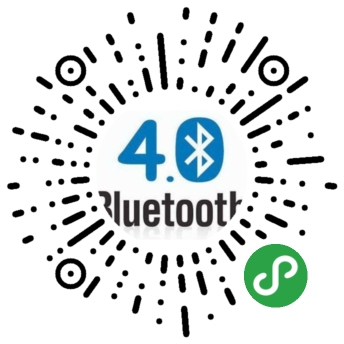

### 一、微信小程序开发相关资料：

* [微信公众平台:](https://mp.weixin.qq.com/)
    * 开发小程序或公众号需要先到这里注册
* [小程序官方文档:](https://mp.weixin.qq.com/debug/wxadoc/introduction/index.html?t=2018313)
    * 微信小程序开发离不了官方文档。
* [小程序官方开发文档:](https://mp.weixin.qq.com/debug/wxadoc/dev/index.html?t=20171117)
    * 微信小程序开发离不了官方开发文档。

### 二、主要效果图

### 三、简述
#### 1.蓝牙BLE调试工具终于上线了！
这段时间研究了小程序蓝牙API的使用方法，从扫描到连接，从读写数据到监听接收数据，总算调通了整个开发流程！为了方便后续项目的调试，于是乎才有了这个小程序————蓝牙BLE调试工具。

#### 2.关于蓝牙
蓝牙有传统蓝牙(3.0以下)和低功耗蓝牙（BLE，又称蓝牙4.0）之分，下面简述就下传统蓝牙和低功耗蓝牙区别：
* BLE蓝牙较传统蓝牙， 传输速度更快，覆盖范围更广，安全性更高，延迟更短，耗电极低等等优点
* 传统蓝牙与BLE蓝牙通信方式也有所不同，传统的一般通过socket方式，而BLE蓝牙是通过Gatt协议来实现
* 传统蓝牙可以用与数据量比较大的传输，如语音，音乐，较高数据量传输等；
* 低功耗蓝牙应用于实时性要求比较高，但是数据速率比较低的产品，如遥控类的，如鼠标、键盘、血压计、温度传感器等。

#### 3.兼容版本
安卓手机：Android4.3以上、微信APP客户端6.5.7以上；
苹果手机：iPhone4s以上并且系统要求ios6以上、微信APP客户端6.5.6以上；

#### 4.使用
整个开发流程为：
* 判断系统是否支持蓝牙BLE
* 初始化蓝牙适配器
* 扫描
* 连接
* 获取服务UUID、读写和监听的UUID
* 进行读或写操作，监听接收数据
* 断开连接
##### 关于具体使用方法，请查看官方开发文档！

#### 5.使用小程序蓝牙API需要注意什么？
* 手机系统和微信版本是否支持蓝牙BLE
* 有些Android6.0以上手机需要开启定位才能搜索蓝牙
* 发送和接收数据是否超过20字节
* ios和Android扫描蓝牙获取到的deviceId不一样
* 等等等

### 四、欢迎体验
* 目前小程序已经上线，整个开发流程也算是大概了解和尝试过了。最后贴出小程序码，欢迎体验！
* 
* 最近建了公众号，欢迎大家关注，一起学习Android、小程序、跨平台开发~
* 